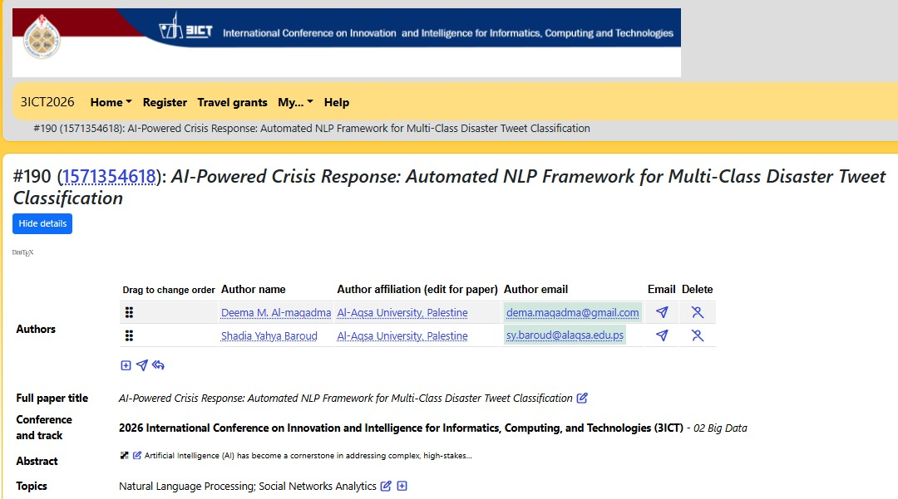

# AI-Powered Crisis Response – NLP Project

This repository contains all materials from my **AI & NLP project** on disaster tweet classification.  
It combines **practical implementation** in Python (Colab notebook) with an **academic research paper** submitted to the **2026 International Conference on Innovation and Intelligence for Informatics, Computing, and Technologies (3ICT2026)**.

---

## 📚 Project Content
During this project I worked on:

- **Practical Implementation (Colab Notebook)**  
  - Preprocessing tweets (cleaning, tokenization, stopword removal).  
  - Feature extraction using TF-IDF.  
  - Training machine learning models (Logistic Regression, SVM, Random Forest).  
  - Evaluation using accuracy, precision, recall, and F1-score.  

- **Research Paper**  
  - Title: *AI-Powered Crisis Response: Automated NLP Framework for Multi-Class Disaster Tweet Classification*.  
  - Submitted to **3ICT2026 – Big Data Track**.  
  - Focus: Leveraging NLP and ML for real-time disaster response.  

- **References**  
  - Supporting materials and datasets used in the research.  

- **Presentation**  
  - Slides explaining the project idea, workflow, and results.  
  - Includes visualizations of preprocessing, classification, and evaluation.  

---

## 📂 Repository Structure
- **AI_NLP_Project.ipynb** → Colab notebook with full implementation.  
- **1571354618 paper.pdf** → Research paper submitted to 3ICT2026.  
- **REFERENCES.txt** → References and supporting materials.  
- **Presentation/** → Project presentation slides (to be added).  

---

## 🚀 Project Idea
The goal of this project was to build an **automated NLP framework** capable of classifying tweets into multiple categories:  
- Disaster-related (e.g., earthquake, flood, fire).  
- Non-disaster or irrelevant tweets.  

This framework demonstrates how **AI can support crisis response systems** by filtering and analyzing social media data in real time.

---

## 🎥 Video Presentation
- **Project Presentation (Practical Demo)**  
  [Watch here](https://youtu.be/PUrV0Z5598E?si=U5GKtRj6Htr5CDs_)

---

## 📖 Conference Submission
This project was submitted to the **2026 International Conference on Innovation and Intelligence for Informatics, Computing, and Technologies (3ICT2026)**.  
Track: **Big Data**  
Topics: **Natural Language Processing, Social Networks Analytics**  

---

## 📖 Summary
This repository highlights my individual work on **AI-powered disaster tweet classification**.  
It combines **hands-on implementation** in Python with **academic research** and a **conference submission**.  
Through this project, I gained practical and theoretical experience in applying **NLP + ML** for real-world crisis response.
